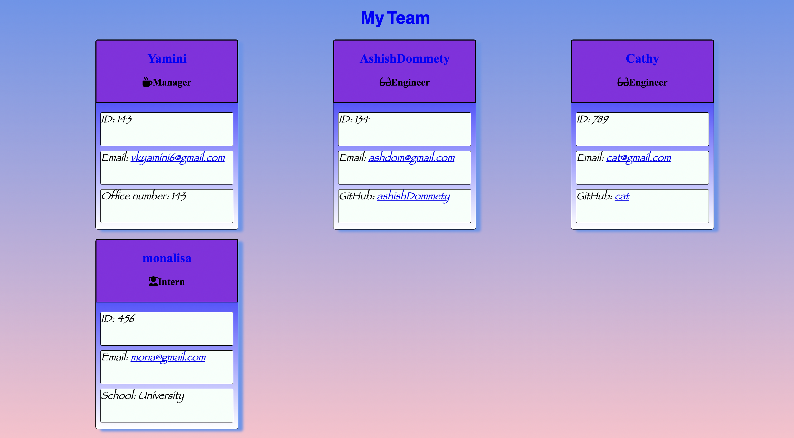

# Generate Team Profile
    
 

## Screenshot

## Table of Contents
  
  - [Description](#Description)
  - [Contributing](#Contributing)
  - [Usage](#Usage)
  - [License](#License)
  - [Installation](#Installation)
  - [Test](#Test)
  - [Question](#Question)
  
  ## Description
  To create HTML page with employee card for a Team with Manager,Engineer and Intern from taking inputs from the commandline
  
  ## Contributing
  NA
  
  ## Usage
  NA
  
  ## License
  MIT
  
  click on the link to learn about the License [MIT](https://chooselicense.com/licenses/mit)
  
  ## Installation
  NA
  
  ## Test
  NA
  
  licensed under [MIT](https://chooselicense.com/licenses/mit)
  
  ## Question
  NA
  link to my recording is : https://drive.google.com/file/d/12ThglQ7yFSu9HazLxNomUULCOOnR4v-a/view
    
  My GitHub profile is https://github.com/vkyamini
    
  
  For further questions please reach me at vkyamini6@gmail.com

  link to my recording is 
  